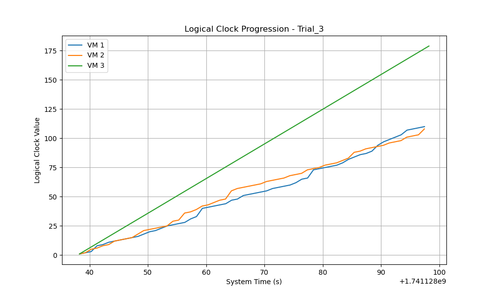
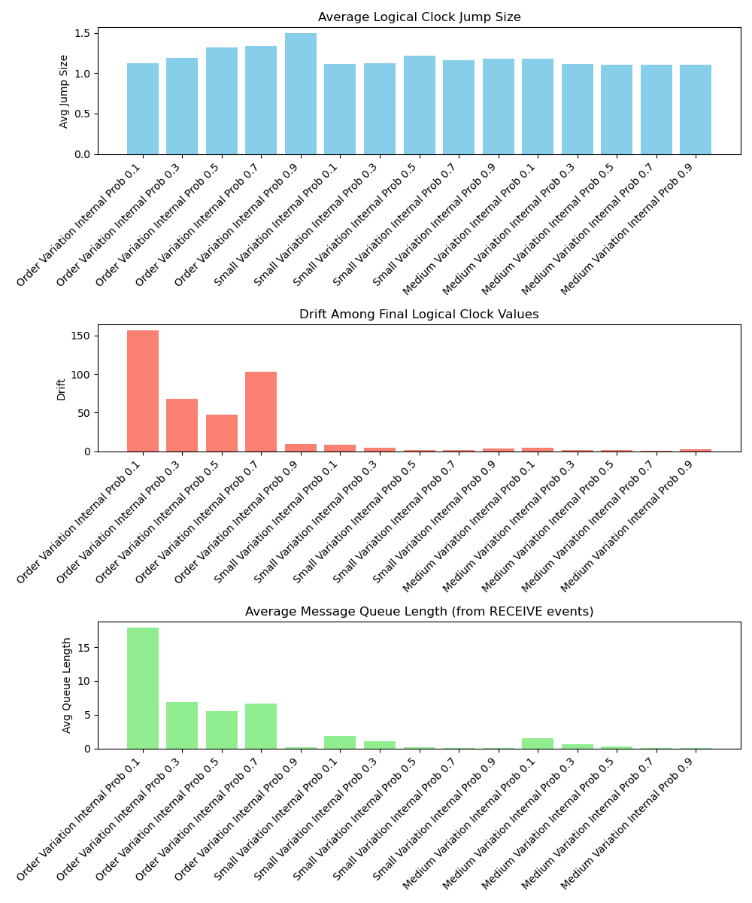

# Coding Project Journal

## Link to Project

https://github.com/Nickanda/cs2620

## Table of Contents

- [Coding Project Journal](#coding-project-journal)
  - [Link to Project](#link-to-project)
  - [Table of Contents](#table-of-contents)
  - [Development Log](#development-log)
    - [February 28, 2025](#february-28-2025)
      - [Progress](#progress)
      - [Issues Encountered](#issues-encountered)
      - [Next Steps](#next-steps)
    - [March 3, 2025](#march-3-2025)
      - [Progress](#progress-1)
      - [Issues Encountered](#issues-encountered-1)
      - [Next Steps](#next-steps-1)
    - [March 2, 2025](#march-2-2025)
      - [Progress](#progress-2)
      - [Next Steps](#next-steps-2)
  - [Report on Findings](#report-on-findings)
  - [Appendix (Raw Data)](#appendix-raw-data)
    - [Order Variation](#order-variation)
      - [Order Variation, Internal Prob 0.1](#order-variation-internal-prob-01)
      - [Order Variation, Internal Prob 0.3](#order-variation-internal-prob-03)
      - [Order Variation, Internal Prob 0.5](#order-variation-internal-prob-05)
      - [Order Variation, Internal Prob 0.7](#order-variation-internal-prob-07)
      - [Order Variation, Internal Prob 0.9](#order-variation-internal-prob-09)
    - [Small Variation](#small-variation)
      - [Small Variation, Internal Prob 0.1](#small-variation-internal-prob-01)
      - [Small Variation, Internal Prob 0.3](#small-variation-internal-prob-03)
      - [Small Variation, Internal Prob 0.5](#small-variation-internal-prob-05)
      - [Small Variation, Internal Prob 0.7](#small-variation-internal-prob-07)
      - [Small Variation, Internal Prob 0.9](#small-variation-internal-prob-09)

## Development Log

### February 28, 2025

#### Progress

- Implemented the simulation for the concurrent processes problem using asynchronous virtual machines.
- Developed a Python-based model that simulates a distributed system with multiple virtual machines, each running at its own clock rate and maintaining its own logical clock.
- Integrated socket-based communication to allow virtual machines to exchange messages and update their logical clocks using Lamport’s algorithm.
- Added detailed logging to capture system time, event types (send, receive, internal), logical clock updates, and message queue lengths for subsequent analysis.
- Conducted initial tests to observe clock drift, message queue behavior, and the impact of varied clock speeds on event ordering.

#### Issues Encountered

- Faced synchronization challenges with establishing and maintaining concurrent socket connections between processes.
- Noticed occasional discrepancies in logical clock updates during high-frequency message passing, necessitating further refinements.
- Experienced intermittent buffering issues with message packets that required adjustments in the network communication handling.
- Encountered unexpected delays in processing messages under certain clock rate conditions, prompting additional debugging and performance tuning.

[Back to Table of Contents](#table-of-contents)

---

#### Next Steps

- Refine the logical clock update mechanism to ensure accurate and consistent event ordering under concurrent loads.
- Enhance error handling and buffering strategies for the socket connections to improve message reliability.
- Conduct more extensive testing with varied clock rate parameters to further analyze clock drift and network queue behaviors.
- Prepare a comprehensive demo and documentation that details the design decisions, challenges, and performance observations of the concurrent processes simulation.
- Explore the potential integration of more efficient communication protocols such as gRPC to optimize inter-process messaging.

### March 3, 2025

#### Progress
- Established five trials per experimental condition to ensure statistically meaningful results.
- Designed and implemented an automated experiment runner (run_experiments.py) to conduct trials with different parameter settings and aggregate results.
- Defined four primary experimental conditions:
  - Order variation (clock rates: 1-6 ticks/sec), internal event probability = 0.7.
  - Order variation (clock rates: 1-6 ticks/sec), internal event probability = 0.3.
  - Small variation (clock rates: 2-3 ticks/sec), internal event probability = 0.7.
  - Small variation (clock rates: 2-3 ticks/sec), internal event probability = 0.3.
- Implemented functions to parse log files, compute jump sizes, logical clock drift, and average queue lengths, and generate visual plots.

#### Issues Encountered

- Had to adapt `main.py` to support experimentation by adding parameters to modify clock rate and internal event probability
- Logical clock updates sometimes had unexpectedly large jumps and there were sometimes inconsistent results across trials/high variability in message queue lengths due to a variable naming error

#### Next Steps

- Make sure at least 5 trials were conducted per experimental condition to confirm the observed trends are consistent 
- Generate summary plots comparing jump sizes, drift, and queue lengths etc across conditions for better presenting. 
- Create explanations for observed behaviors to prepare for a structured demo for presentation.
 
### March 2, 2025

#### Progress

- Successfully ran 5 trials per condition, collecting data on logical clock progression, jump sizes, and message queue congestion.
- Refactored log analysis functions to improve efficiency and reduce errors in parsing queue lengths.
- Produced plots:
  - Average Jump Size (higher when internal event probability is low).
  - Clock Drift (larger in the "order variation" condition due to wider range of clock speeds).
  - Average Queue Length (higher when messages are sent more frequently).
- Observations from Experiments

#### Next Steps

- Write up experimental findings relative to theoretical expectations 
- Could consider investigating additional variations, such as:
  - Running the simulation with more VMs instead of just three to test scalability. Also consider what experiments might be possible if running across multiple machines. 
  - Write a structured report summarizing all findings, including:

## Report on Findings

As described above, we decided to run experiments under four conditions, with the following raw data across five trials in the Appendix of this markdown file. Overall, we observed that:

1. The average jump size in the logical clocks increases when internal events occur less frequently (i.e. lower internal_prob), since message receives force the clock to update to max(local, received) + 1.
   - This effect is most pronounced in the order variation setting, where fast VMs frequently send to slow ones.

2. The drift between VMs (difference between highest and lowest final LC values) is also impacted by the variation in clock rates and less frequent internal events. When using the 'order' variation mode, clock rates differ more (1-6 ticks/sec) than in 'small' (2-3 ticks/sec), typically leading to larger drift.
     - When VMs have a large speed variation (1-6 ticks/sec), drift can accumulate more significantly (see the following plot from the large speed variation and high internal probability for the possible consequences of a combination of the impact of 1 and 2, with large jumps and drift)
    

3. We also find that the average message queue lengths (in the RECEIVE events) vary and can indicate congestion when sending events are more frequent.
   - Queue lengths spike when sending probability increases (internal_prob = 0.3).
   - High congestion is observed in slow VMs receiving messages from multiple fast VMs, causing delays in processing.
   - This confirms that message-heavy conditions can lead to delayed logical clock updates.

Overall, the impacts described above can be seen in the following plot:
  

## Appendix (Raw Data)

### Order Variation

#### Order Variation, Internal Prob 0.1

| Trial Number | VM 1 clock rate | VM 2 clock rate | VM 3 clock rate | avg_jump | drift | avg_queue_length |
|-------------|----------------|----------------|----------------|----------|-------|------------------|
| 1           | 2              | 5              | 5              | 1.05     | 141   | 19.40            |
| 2           | 3              | 1              | 6              | 1.27     | 255   | 33.01            |
| 3           | 1              | 2              | 2              | 1.06     | 43    | 5.91             |
| 4           | 1              | 3              | 5              | 1.30     | 190   | 17.17            |
| 5           | 1              | 1              | 5              | 1.16     | 205   | 63.35            |

- **Average Jump Size:** 1.17
- **Drift among VMs:** 166.8
- **Average Queue Length (RECEIVE events):** 27.77

#### Order Variation, Internal Prob 0.3

| Trial Number | VM 1 clock rate | VM 2 clock rate | VM 3 clock rate | avg_jump | drift | avg_queue_length |
|-------------|----------------|----------------|----------------|----------|-------|------------------|
| 1           | 4              | 4              | 4              | 1.00     | 0     | 0.22             |
| 2           | 6              | 6              | 5              | 1.06     | 0     | 0.31             |
| 3           | 1              | 1              | 3              | 1.33     | 71    | 16.62            |
| 4           | 5              | 3              | 3              | 1.36     | 3     | 0.70             |
| 5           | 1              | 5              | 3              | 1.34     | 170   | 11.88            |

- **Average Jump Size:** 1.22
- **Drift among VMs:** 48.8
- **Average Queue Length (RECEIVE events):** 5.95

#### Order Variation, Internal Prob 0.5

| Trial Number | VM 1 clock rate | VM 2 clock rate | VM 3 clock rate | avg_jump | drift | avg_queue_length |
|-------------|----------------|----------------|----------------|----------|-------|------------------|
| 1           | 3              | 4              | 5              | 1.24     | 3     | 0.29             |
| 2           | 5              | 3              | 6              | 1.28     | 1     | 0.62             |
| 3           | 6              | 5              | 2              | 1.26     | 88    | 9.25             |
| 4           | 4              | 2              | 2              | 1.48     | 6     | 0.64             |
| 5           | 1              | 6              | 2              | 1.59     | 192   | 11.74            |

- **Average Jump Size:** 1.37
- **Drift among VMs:** 58.0
- **Average Queue Length (RECEIVE events):** 4.51

#### Order Variation, Internal Prob 0.7

| Trial Number | VM 1 clock rate | VM 2 clock rate | VM 3 clock rate | avg_jump | drift | avg_queue_length |
|-------------|----------------|----------------|----------------|----------|-------|------------------|
| 1           | 3              | 6              | 5              | 1.28     | 3     | 0.33             |
| 2           | 6              | 2              | 6              | 1.26     | 16    | 1.48             |
| 3           | 2              | 1              | 3              | 1.47     | 8     | 0.23             |
| 4           | 6              | 5              | 5              | 1.12     | 2     | 0.06             |
| 5           | 5              | 3              | 6              | 1.28     | 2     | 0.16             |

- **Average Jump Size:** 1.28
- **Drift among VMs:** 6.2
- **Average Queue Length (RECEIVE events):** 0.45

#### Order Variation, Internal Prob 0.9

| Trial Number | VM 1 clock rate | VM 2 clock rate | VM 3 clock rate | avg_jump | drift | avg_queue_length |
|-------------|----------------|----------------|----------------|----------|-------|------------------|
| 1           | 5              | 4              | 5              | 1.07     | 2     | 0.02             |
| 2           | 6              | 3              | 1              | 1.74     | 34    | 0.26             |
| 3           | 3              | 4              | 5              | 1.24     | 2     | 0.03             |
| 4           | 5              | 1              | 2              | 1.85     | 8     | 0.11             |
| 5           | 4              | 3              | 2              | 1.30     | 9     | 0.00             |

- **Average Jump Size:** 1.44
- **Drift among VMs:** 11.0
- **Average Queue Length (RECEIVE events):** 0.08

### Small Variation

#### Small Variation, Internal Prob 0.1

| Trial Number | VM 1 clock rate | VM 2 clock rate | VM 3 clock rate | avg_jump | drift | avg_queue_length |
|-------------|----------------|----------------|----------------|----------|-------|------------------|
| 1           | 2              | 2              | 3              | 1.27     | 6     | 0.98             |
| 2           | 2              | 2              | 3              | 1.27     | 3     | 2.68             |
| 3           | 3              | 3              | 3              | 1.00     | 0     | 0.45             |
| 4           | 3              | 3              | 3              | 1.00     | 0     | 0.29             |
| 5           | 2              | 2              | 2              | 1.00     | 0     | 0.25             |

- **Average Jump Size:** 1.11
- **Drift among VMs:** 1.8
- **Average Queue Length (RECEIVE events):** 0.93

#### Small Variation, Internal Prob 0.3

| Trial Number | VM 1 clock rate | VM 2 clock rate | VM 3 clock rate | avg_jump | drift | avg_queue_length |
|-------------|----------------|----------------|----------------|----------|-------|------------------|
| 1           | 2              | 3              | 2              | 1.28     | 1     | 0.61             |
| 2           | 2              | 3              | 2              | 1.27     | 6     | 0.60             |
| 3           | 3              | 2              | 3              | 1.11     | 6     | 0.60             |
| 4           | 3              | 2              | 2              | 1.27     | 4     | 0.40             |
| 5           | 2              | 2              | 2              | 1.00     | 0     | 0.16             |

- **Average Jump Size:** 1.19
- **Drift among VMs:** 3.4
- **Average Queue Length (RECEIVE events):** 0.48

#### Small Variation, Internal Prob 0.5

| Trial Number | VM 1 clock rate | VM 2 clock rate | VM 3 clock rate | avg_jump | drift | avg_queue_length |
|-------------|----------------|----------------|----------------|----------|-------|------------------|
| 1           | 3              | 2              | 3              | 1.12     | 3     | 0.12             |
| 2           | 2              | 3              | 3              | 1.13     | 1     | 0.53             |
| 3           | 2              | 2              | 3              | 1.28     | 2     | 0.33             |
| 4           | 3              | 2              | 3              | 1.12     | 2     | 0.29             |
| 5           | 2              | 3              | 2              | 1.27     | 2     | 0.25             |

- **Average Jump Size:** 1.18
- **Drift among VMs:** 2.0
- **Average Queue Length (RECEIVE events):** 0.30

#### Small Variation, Internal Prob 0.7

| Trial Number | VM 1 clock rate | VM 2 clock rate | VM 3 clock rate | avg_jump | drift | avg_queue_length |
|-------------|----------------|----------------|----------------|----------|-------|------------------|
| 1           | 3              | 3              | 3              | 1.00     | 1     | 0.11             |
| 2           | 3              | 3              | 3              | 1.00     | 1     | 0.06             |
| 3           | 2              | 3              | 3              | 1.12     | 2     | 0.14             |
| 4           | 3              | 2              | 2              | 1.27     | 2     | 0.22             |
| 5           | 2              | 2              | 2              | 1.00     | 0     | 0.05             |

- **Average Jump Size:** 1.08
- **Drift among VMs:** 1.2
- **Average Queue Length (RECEIVE events):** 0.12

#### Small Variation, Internal Prob 0.9

| Trial Number | VM 1 clock rate | VM 2 clock rate | VM 3 clock rate | avg_jump | drift | avg_queue_length |
|-------------|----------------|----------------|----------------|----------|-------|------------------|
| 1           | 2              | 2              | 2              | 1.00     | 0     | 0.03             |
| 2           | 3              | 2              | 3              | 1.12     | 2     | 0.00             |
| 3           | 2              | 3              | 2              | 1.26     | 8     | 0.08             |
| 4           | 3              | 2              | 3              | 1.12     | 2     | 0.02             |
| 5           | 3              | 2              | 2              | 1.28     | 2     | 0.02             |

**Condition [Small Variation, Internal Prob 0.9] averaged over 5 trials:**
- **Average Jump Size:** 1.16
- **Drift among VMs:** 2.8
- **Average Queue Length (RECEIVE events):** 0.03
