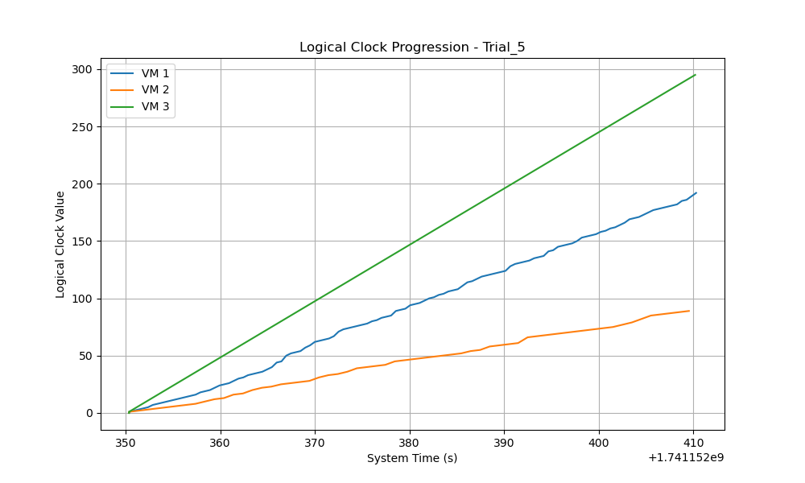
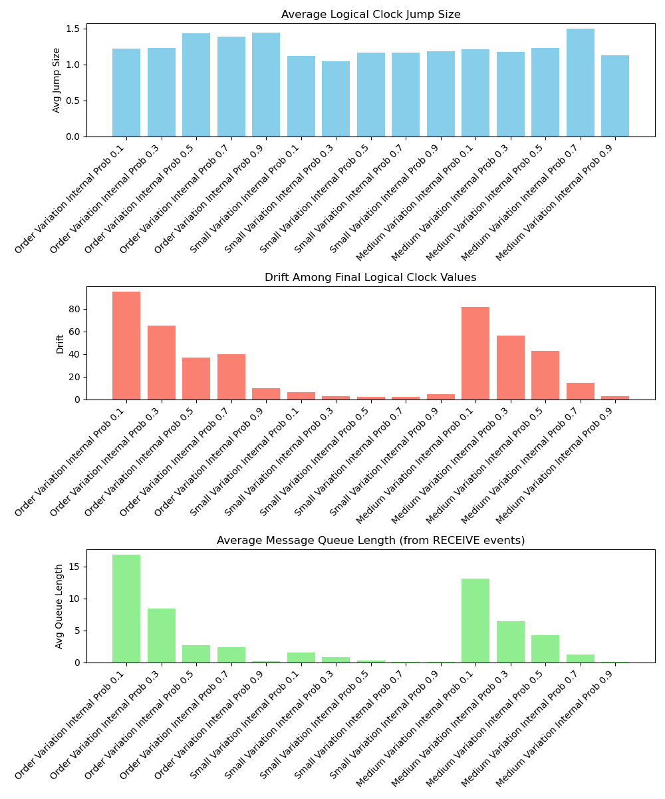

# Coding Project Journal

## Link to Project

https://github.com/Nickanda/cs2620

## Table of Contents

- [Coding Project Journal](#coding-project-journal)
  - [Link to Project](#link-to-project)
  - [Table of Contents](#table-of-contents)
  - [Development Log](#development-log)
    - [February 28, 2025](#february-28-2025)
      - [Progress](#progress)
      - [Issues Encountered](#issues-encountered)
    - [March 3, 2025](#march-3-2025)
      - [Progress](#progress-1)
      - [Issues Encountered](#issues-encountered-1)
      - [Next Steps](#next-steps)
    - [March 4, 2025](#march-4-2025)
      - [Progress](#progress-2)
      - [Next Steps](#next-steps-1)
    - [March 5, 2025](#march-5-2025)
      - [Progress](#progress-3)
      - [Issues Encountered](#issues-encountered-2)
      - [Next Steps](#next-steps-2)
  - [Report on Findings](#report-on-findings)
      - [Overall Observations](#overall-observations)
  - [Appendix](#appendix)

## Development Log

### February 28, 2025

#### Progress

- Implemented the simulation for the concurrent processes problem using asynchronous virtual machines.
- Developed a Python-based model that simulates a distributed system with multiple virtual machines, each running at its own clock rate and maintaining its own logical clock.
- Integrated socket-based communication to allow virtual machines to exchange messages and update their logical clocks using Lamport’s algorithm.
- Added detailed logging to capture system time, event types (send, receive, internal), logical clock updates, and message queue lengths for subsequent analysis.
- Conducted initial tests to observe clock drift, message queue behavior, and the impact of varied clock speeds on event ordering.

#### Issues Encountered

- Faced synchronization challenges with establishing and maintaining concurrent socket connections between processes.
- Noticed occasional discrepancies in logical clock updates during high-frequency message passing, necessitating further refinements.
- Experienced intermittent buffering issues with message packets that required adjustments in the network communication handling.
- Encountered unexpected delays in processing messages under certain clock rate conditions, prompting additional debugging and performance tuning.

[Back to Table of Contents](#table-of-contents)

---

### March 3, 2025

#### Progress

- Established five trials per experimental condition to ensure statistically meaningful results.
- Designed and implemented an automated experiment runner (run_experiments.py) to conduct trials with different parameter settings and aggregate results.
- Defined four primary experimental conditions:
  - Order variation (clock rates: 1-6 ticks/sec), internal event probability = 0.7.
  - Order variation (clock rates: 1-6 ticks/sec), internal event probability = 0.3.
  - Small variation (clock rates: 2-3 ticks/sec), internal event probability = 0.7.
  - Small variation (clock rates: 2-3 ticks/sec), internal event probability = 0.3.
- Implemented functions to parse log files, compute jump sizes, logical clock drift, and average queue lengths, and generate visual plots.

#### Issues Encountered

- Had to adapt `main.py` to support experimentation by adding parameters to modify clock rate and internal event probability
- Logical clock updates sometimes had unexpectedly large jumps and there were sometimes inconsistent results across trials/high variability in message queue lengths due to a variable naming error

#### Next Steps

- Make sure at least 5 trials were conducted per experimental condition to confirm the observed trends are consistent
- Generate summary plots comparing jump sizes, drift, and queue lengths etc across conditions for better presenting.
- Create explanations for observed behaviors to prepare for a structured demo for presentation.

---

### March 4, 2025

#### Progress

- Successfully ran 5 trials per condition, collecting data on logical clock progression, jump sizes, and message queue congestion.
- Refactored log analysis functions to improve efficiency and reduce errors in parsing queue lengths.
- Produced plots:
  - Average Jump Size (found generally higher when internal event probability is low).
  - Clock Drift (found generally larger in the "order variation" condition due to wider range of clock speeds).
  - Average Queue Length (found generally higher when messages are sent more frequently).

#### Next Steps

- Write up experimental findings relative to theoretical expectations
- Could consider investigating additional variations, such as:
  - Running the simulation with more VMs instead of just three to test scalability. Also consider what experiments might be possible if running across multiple machines.
  - Write a structured report summarizing all findings, including:


---

### March 5, 2025

#### Progress

- Ran many more expeirments including visualizations adapting `main.py` and `analysis.py`
- Decided to run additional experimental configurations to validate findings, including a medium range case (outside of those done above), so the final conditions were probabilities in ```{0.1, 0.3, 0.5, 0.7, 0.9}``` and three variations, since realized that just the four conditions above were not robust enough to draw the conclusions:
  
  ```{python}
  if args.variation_mode == "order":
        clock_rate_range = (1, 6)
    elif args.variation_mode == "small":
        clock_rate_range = (2, 3)
    else: 
        clock_rate_range = (1, 4)  # medium
  ```

#### Issues Encountered

- Had to deal with running experiments a couple times which took an extremely long time and then had to be rerun which was very annoying. Decided to implement a threading-based approach for things to take less time. 
- Forgot to save important data so had to re-run data (printed rather than saving), forcusing time-consuming re-runs

#### Next Steps

- Produce final report (see below)
[Back to Table of Contents](#table-of-contents)


[Back to Table of Contents](#table-of-contents)

---

## Report on Findings

As described above, we decided to run experiments under four conditions, with the raw data stored in the Appendix of this markdown (below). Overall, 75 experiments were run, 5 for each of 15 tested conditions.

#### Overall Observations

1. The average jump size in the logical clocks increases when internal events occur less frequently (i.e. lower internal_prob), since message receives force the clock to update to max(local, received) + 1.
   - This effect is most pronounced in the order variation setting, where fast VMs frequently send to slow ones.

2. The drift between VMs (difference between highest and lowest final LC values) is also impacted by the variation in clock rates and less frequent internal events. When using the 'order' variation mode, clock rates differ more (1-6 ticks/sec) than in 'small' (2-3 ticks/sec), typically leading to larger drift.
     - When VMs have a large speed variation (1-6 ticks/sec), drift can accumulate more significantly (see the following plot from the large speed variation and high internal probability for the possible consequences of a combination of the impact of 1 and 2, with large jumps and drift)
     - Drift can accumulate and there are large ranges in the raw data
    

3. We also find that the average message queue lengths (in the RECEIVE events) vary and can indicate congestion when sending events are more frequent.
   - Queue lengths spike when sending probability increases (internal_prob = 0.3).
   - High congestion is observed in slow VMs receiving messages from multiple fast VMs, causing delays in processing.
   - This confirms that message-heavy conditions can lead to delayed logical clock updates.

Overall, the impacts described above can be seen in the following plot:
  

[Back to Table of Contents](#table-of-contents)

## Appendix 

========================================
Running experiment: Order Variation Internal Prob 0.1
Running simulation: variation_mode=order, internal_prob=0.1 for 60 sec in 'Order_Variation_Internal_Prob_0.1/trial_1'
Plot saved: Order_Variation_Internal_Prob_0.1/trial_1/Trial_1_logical_clock_progression.png
Trial 1: avg_jump=1.30, drift=55, avg_queue_length=14.32
Running simulation: variation_mode=order, internal_prob=0.1 for 60 sec in 'Order_Variation_Internal_Prob_0.1/trial_2'
Plot saved: Order_Variation_Internal_Prob_0.1/trial_2/Trial_2_logical_clock_progression.png
Trial 2: avg_jump=1.26, drift=161, avg_queue_length=18.61
Running simulation: variation_mode=order, internal_prob=0.1 for 60 sec in 'Order_Variation_Internal_Prob_0.1/trial_3'
Plot saved: Order_Variation_Internal_Prob_0.1/trial_3/Trial_3_logical_clock_progression.png
Trial 3: avg_jump=1.08, drift=9, avg_queue_length=1.37
Running simulation: variation_mode=order, internal_prob=0.1 for 60 sec in 'Order_Variation_Internal_Prob_0.1/trial_4'
Plot saved: Order_Variation_Internal_Prob_0.1/trial_4/Trial_4_logical_clock_progression.png
Trial 4: avg_jump=1.24, drift=44, avg_queue_length=5.71
Running simulation: variation_mode=order, internal_prob=0.1 for 60 sec in 'Order_Variation_Internal_Prob_0.1/trial_5'
Plot saved: Order_Variation_Internal_Prob_0.1/trial_5/Trial_5_logical_clock_progression.png
Trial 5: avg_jump=1.21, drift=206, avg_queue_length=44.09
Condition [Order Variation Internal Prob 0.1] over 5 trials:
  Average Jump Size: 1.22
  Drift among VMs: 95.0
  Average Queue Length: 16.82

Trial Results:
Trial | VM1_Rate | VM2_Rate | VM3_Rate | AvgJump | Drift | AvgQueue
------|----------|----------|----------|---------|-------|---------
    1 |         2 |         2 |         4 | 1.30 | 55 | 14.32
    2 |         4 |         6 |         2 | 1.26 | 161 | 18.61
    3 |         4 |         4 |         3 | 1.08 | 9 | 1.37
    4 |         2 |         3 |         4 | 1.24 | 44 | 5.71
    5 |         2 |         1 |         5 | 1.21 | 206 | 44.09

========================================
Running experiment: Order Variation Internal Prob 0.3
Running simulation: variation_mode=order, internal_prob=0.3 for 60 sec in 'Order_Variation_Internal_Prob_0.3/trial_1'
Plot saved: Order_Variation_Internal_Prob_0.3/trial_1/Trial_1_logical_clock_progression.png
Trial 1: avg_jump=1.00, drift=0, avg_queue_length=0.27
Running simulation: variation_mode=order, internal_prob=0.3 for 60 sec in 'Order_Variation_Internal_Prob_0.3/trial_2'
Plot saved: Order_Variation_Internal_Prob_0.3/trial_2/Trial_2_logical_clock_progression.png
Trial 2: avg_jump=1.28, drift=2, avg_queue_length=0.66
Running simulation: variation_mode=order, internal_prob=0.3 for 60 sec in 'Order_Variation_Internal_Prob_0.3/trial_3'
Plot saved: Order_Variation_Internal_Prob_0.3/trial_3/Trial_3_logical_clock_progression.png
Trial 3: avg_jump=1.23, drift=126, avg_queue_length=9.67
Running simulation: variation_mode=order, internal_prob=0.3 for 60 sec in 'Order_Variation_Internal_Prob_0.3/trial_4'
Plot saved: Order_Variation_Internal_Prob_0.3/trial_4/Trial_4_logical_clock_progression.png
Trial 4: avg_jump=1.27, drift=4, avg_queue_length=0.54
Running simulation: variation_mode=order, internal_prob=0.3 for 60 sec in 'Order_Variation_Internal_Prob_0.3/trial_5'
Plot saved: Order_Variation_Internal_Prob_0.3/trial_5/Trial_5_logical_clock_progression.png
Trial 5: avg_jump=1.38, drift=193, avg_queue_length=30.89
Condition [Order Variation Internal Prob 0.3] over 5 trials:
  Average Jump Size: 1.23
  Drift among VMs: 65.0
  Average Queue Length: 8.41

Trial Results:
Trial | VM1_Rate | VM2_Rate | VM3_Rate | AvgJump | Drift | AvgQueue
------|----------|----------|----------|---------|-------|---------
    1 |         1 |         1 |         1 | 1.00 | 0 | 0.27
    2 |         4 |         6 |         4 | 1.28 | 2 | 0.66
    3 |         1 |         4 |         3 | 1.23 | 126 | 9.67
    4 |         3 |         2 |         2 | 1.27 | 4 | 0.54
    5 |         1 |         6 |         2 | 1.38 | 193 | 30.89

========================================
Running experiment: Order Variation Internal Prob 0.5
Running simulation: variation_mode=order, internal_prob=0.5 for 60 sec in 'Order_Variation_Internal_Prob_0.5/trial_1'
Plot saved: Order_Variation_Internal_Prob_0.5/trial_1/Trial_1_logical_clock_progression.png
Trial 1: avg_jump=1.27, drift=9, avg_queue_length=0.58
Running simulation: variation_mode=order, internal_prob=0.5 for 60 sec in 'Order_Variation_Internal_Prob_0.5/trial_2'
Plot saved: Order_Variation_Internal_Prob_0.5/trial_2/Trial_2_logical_clock_progression.png
Trial 2: avg_jump=1.31, drift=32, avg_queue_length=3.02
Running simulation: variation_mode=order, internal_prob=0.5 for 60 sec in 'Order_Variation_Internal_Prob_0.5/trial_3'
Plot saved: Order_Variation_Internal_Prob_0.5/trial_3/Trial_3_logical_clock_progression.png
Trial 3: avg_jump=1.63, drift=11, avg_queue_length=1.61
Running simulation: variation_mode=order, internal_prob=0.5 for 60 sec in 'Order_Variation_Internal_Prob_0.5/trial_4'
Plot saved: Order_Variation_Internal_Prob_0.5/trial_4/Trial_4_logical_clock_progression.png
Trial 4: avg_jump=1.57, drift=132, avg_queue_length=8.07
Running simulation: variation_mode=order, internal_prob=0.5 for 60 sec in 'Order_Variation_Internal_Prob_0.5/trial_5'
Plot saved: Order_Variation_Internal_Prob_0.5/trial_5/Trial_5_logical_clock_progression.png
Trial 5: avg_jump=1.36, drift=0, avg_queue_length=0.27
Condition [Order Variation Internal Prob 0.5] over 5 trials:
  Average Jump Size: 1.43
  Drift among VMs: 36.8
  Average Queue Length: 2.71

Trial Results:
Trial | VM1_Rate | VM2_Rate | VM3_Rate | AvgJump | Drift | AvgQueue
------|----------|----------|----------|---------|-------|---------
    1 |         3 |         6 |         5 | 1.27 | 9 | 0.58
    2 |         4 |         5 |         2 | 1.31 | 32 | 3.02
    3 |         2 |         2 |         5 | 1.63 | 11 | 1.61
    4 |         5 |         1 |         2 | 1.57 | 132 | 8.07
    5 |         5 |         3 |         3 | 1.36 | 0 | 0.27

========================================
Running experiment: Order Variation Internal Prob 0.7
Running simulation: variation_mode=order, internal_prob=0.7 for 60 sec in 'Order_Variation_Internal_Prob_0.7/trial_1'
Plot saved: Order_Variation_Internal_Prob_0.7/trial_1/Trial_1_logical_clock_progression.png
Trial 1: avg_jump=1.32, drift=123, avg_queue_length=5.74
Running simulation: variation_mode=order, internal_prob=0.7 for 60 sec in 'Order_Variation_Internal_Prob_0.7/trial_2'
Plot saved: Order_Variation_Internal_Prob_0.7/trial_2/Trial_2_logical_clock_progression.png
Trial 2: avg_jump=1.23, drift=27, avg_queue_length=2.43
Running simulation: variation_mode=order, internal_prob=0.7 for 60 sec in 'Order_Variation_Internal_Prob_0.7/trial_3'
Plot saved: Order_Variation_Internal_Prob_0.7/trial_3/Trial_3_logical_clock_progression.png
Trial 3: avg_jump=1.94, drift=10, avg_queue_length=0.61
Running simulation: variation_mode=order, internal_prob=0.7 for 60 sec in 'Order_Variation_Internal_Prob_0.7/trial_4'
Plot saved: Order_Variation_Internal_Prob_0.7/trial_4/Trial_4_logical_clock_progression.png
Trial 4: avg_jump=1.27, drift=39, avg_queue_length=2.58
Running simulation: variation_mode=order, internal_prob=0.7 for 60 sec in 'Order_Variation_Internal_Prob_0.7/trial_5'
Plot saved: Order_Variation_Internal_Prob_0.7/trial_5/Trial_5_logical_clock_progression.png
Trial 5: avg_jump=1.19, drift=1, avg_queue_length=0.19
Condition [Order Variation Internal Prob 0.7] over 5 trials:
  Average Jump Size: 1.39
  Drift among VMs: 40.0
  Average Queue Length: 2.31

Trial Results:
Trial | VM1_Rate | VM2_Rate | VM3_Rate | AvgJump | Drift | AvgQueue
------|----------|----------|----------|---------|-------|---------
    1 |         5 |         6 |         1 | 1.32 | 123 | 5.74
    2 |         3 |         1 |         3 | 1.23 | 27 | 2.43
    3 |         1 |         1 |         4 | 1.94 | 10 | 0.61
    4 |         4 |         4 |         1 | 1.27 | 39 | 2.58
    5 |         3 |         6 |         6 | 1.19 | 1 | 0.19

========================================
Running experiment: Order Variation Internal Prob 0.9
Running simulation: variation_mode=order, internal_prob=0.9 for 60 sec in 'Order_Variation_Internal_Prob_0.9/trial_1'
Plot saved: Order_Variation_Internal_Prob_0.9/trial_1/Trial_1_logical_clock_progression.png
Trial 1: avg_jump=1.45, drift=16, avg_queue_length=0.46
Running simulation: variation_mode=order, internal_prob=0.9 for 60 sec in 'Order_Variation_Internal_Prob_0.9/trial_2'
Plot saved: Order_Variation_Internal_Prob_0.9/trial_2/Trial_2_logical_clock_progression.png
Trial 2: avg_jump=1.36, drift=4, avg_queue_length=0.03
Running simulation: variation_mode=order, internal_prob=0.9 for 60 sec in 'Order_Variation_Internal_Prob_0.9/trial_3'
Plot saved: Order_Variation_Internal_Prob_0.9/trial_3/Trial_3_logical_clock_progression.png
Trial 3: avg_jump=1.47, drift=6, avg_queue_length=0.11
Running simulation: variation_mode=order, internal_prob=0.9 for 60 sec in 'Order_Variation_Internal_Prob_0.9/trial_4'
Plot saved: Order_Variation_Internal_Prob_0.9/trial_4/Trial_4_logical_clock_progression.png
Trial 4: avg_jump=1.47, drift=7, avg_queue_length=0.08
Running simulation: variation_mode=order, internal_prob=0.9 for 60 sec in 'Order_Variation_Internal_Prob_0.9/trial_5'
Plot saved: Order_Variation_Internal_Prob_0.9/trial_5/Trial_5_logical_clock_progression.png
Trial 5: avg_jump=1.46, drift=15, avg_queue_length=0.04
Condition [Order Variation Internal Prob 0.9] over 5 trials:
  Average Jump Size: 1.44
  Drift among VMs: 9.6
  Average Queue Length: 0.15

Trial Results:
Trial | VM1_Rate | VM2_Rate | VM3_Rate | AvgJump | Drift | AvgQueue
------|----------|----------|----------|---------|-------|---------
    1 |         4 |         1 |         5 | 1.45 | 16 | 0.46
    2 |         4 |         3 |         6 | 1.36 | 4 | 0.03
    3 |         3 |         6 |         3 | 1.47 | 6 | 0.11
    4 |         5 |         3 |         2 | 1.47 | 7 | 0.08
    5 |         1 |         4 |         5 | 1.46 | 15 | 0.04

========================================
Running experiment: Small Variation Internal Prob 0.1
Running simulation: variation_mode=small, internal_prob=0.1 for 60 sec in 'Small_Variation_Internal_Prob_0.1/trial_1'
Plot saved: Small_Variation_Internal_Prob_0.1/trial_1/Trial_1_logical_clock_progression.png
Trial 1: avg_jump=1.00, drift=0, avg_queue_length=0.39
Running simulation: variation_mode=small, internal_prob=0.1 for 60 sec in 'Small_Variation_Internal_Prob_0.1/trial_2'
Plot saved: Small_Variation_Internal_Prob_0.1/trial_2/Trial_2_logical_clock_progression.png
Trial 2: avg_jump=1.10, drift=12, avg_queue_length=1.99
Running simulation: variation_mode=small, internal_prob=0.1 for 60 sec in 'Small_Variation_Internal_Prob_0.1/trial_3'
Plot saved: Small_Variation_Internal_Prob_0.1/trial_3/Trial_3_logical_clock_progression.png
Trial 3: avg_jump=1.09, drift=14, avg_queue_length=2.56
Running simulation: variation_mode=small, internal_prob=0.1 for 60 sec in 'Small_Variation_Internal_Prob_0.1/trial_4'
Plot saved: Small_Variation_Internal_Prob_0.1/trial_4/Trial_4_logical_clock_progression.png
Trial 4: avg_jump=1.12, drift=1, avg_queue_length=1.38
Running simulation: variation_mode=small, internal_prob=0.1 for 60 sec in 'Small_Variation_Internal_Prob_0.1/trial_5'
Plot saved: Small_Variation_Internal_Prob_0.1/trial_5/Trial_5_logical_clock_progression.png
Trial 5: avg_jump=1.27, drift=4, avg_queue_length=1.18
Condition [Small Variation Internal Prob 0.1] over 5 trials:
  Average Jump Size: 1.12
  Drift among VMs: 6.2
  Average Queue Length: 1.50

Trial Results:
Trial | VM1_Rate | VM2_Rate | VM3_Rate | AvgJump | Drift | AvgQueue
------|----------|----------|----------|---------|-------|---------
    1 |         2 |         2 |         2 | 1.00 | 0 | 0.39
    2 |         3 |         2 |         3 | 1.10 | 12 | 1.99
    3 |         2 |         3 |         3 | 1.09 | 14 | 2.56
    4 |         3 |         3 |         2 | 1.12 | 1 | 1.38
    5 |         3 |         2 |         2 | 1.27 | 4 | 1.18

========================================
Running experiment: Small Variation Internal Prob 0.3
Running simulation: variation_mode=small, internal_prob=0.3 for 60 sec in 'Small_Variation_Internal_Prob_0.3/trial_1'
Plot saved: Small_Variation_Internal_Prob_0.3/trial_1/Trial_1_logical_clock_progression.png
Trial 1: avg_jump=1.00, drift=0, avg_queue_length=0.28
Running simulation: variation_mode=small, internal_prob=0.3 for 60 sec in 'Small_Variation_Internal_Prob_0.3/trial_2'
Plot saved: Small_Variation_Internal_Prob_0.3/trial_2/Trial_2_logical_clock_progression.png
Trial 2: avg_jump=1.10, drift=11, avg_queue_length=3.01
Running simulation: variation_mode=small, internal_prob=0.3 for 60 sec in 'Small_Variation_Internal_Prob_0.3/trial_3'
Plot saved: Small_Variation_Internal_Prob_0.3/trial_3/Trial_3_logical_clock_progression.png
Trial 3: avg_jump=1.12, drift=2, avg_queue_length=0.34
Running simulation: variation_mode=small, internal_prob=0.3 for 60 sec in 'Small_Variation_Internal_Prob_0.3/trial_4'
Plot saved: Small_Variation_Internal_Prob_0.3/trial_4/Trial_4_logical_clock_progression.png
Trial 4: avg_jump=1.00, drift=0, avg_queue_length=0.17
Running simulation: variation_mode=small, internal_prob=0.3 for 60 sec in 'Small_Variation_Internal_Prob_0.3/trial_5'
Plot saved: Small_Variation_Internal_Prob_0.3/trial_5/Trial_5_logical_clock_progression.png
Trial 5: avg_jump=1.00, drift=0, avg_queue_length=0.25
Condition [Small Variation Internal Prob 0.3] over 5 trials:
  Average Jump Size: 1.04
  Drift among VMs: 2.6
  Average Queue Length: 0.81

Trial Results:
Trial | VM1_Rate | VM2_Rate | VM3_Rate | AvgJump | Drift | AvgQueue
------|----------|----------|----------|---------|-------|---------
    1 |         2 |         2 |         2 | 1.00 | 0 | 0.28
    2 |         3 |         3 |         2 | 1.10 | 11 | 3.01
    3 |         2 |         3 |         3 | 1.12 | 2 | 0.34
    4 |         3 |         3 |         3 | 1.00 | 0 | 0.17
    5 |         3 |         3 |         3 | 1.00 | 0 | 0.25

========================================
Running experiment: Small Variation Internal Prob 0.5
Running simulation: variation_mode=small, internal_prob=0.5 for 60 sec in 'Small_Variation_Internal_Prob_0.5/trial_1'
Plot saved: Small_Variation_Internal_Prob_0.5/trial_1/Trial_1_logical_clock_progression.png
Trial 1: avg_jump=1.26, drift=5, avg_queue_length=0.25
Running simulation: variation_mode=small, internal_prob=0.5 for 60 sec in 'Small_Variation_Internal_Prob_0.5/trial_2'
Plot saved: Small_Variation_Internal_Prob_0.5/trial_2/Trial_2_logical_clock_progression.png
Trial 2: avg_jump=1.13, drift=1, avg_queue_length=0.25
Running simulation: variation_mode=small, internal_prob=0.5 for 60 sec in 'Small_Variation_Internal_Prob_0.5/trial_3'
Plot saved: Small_Variation_Internal_Prob_0.5/trial_3/Trial_3_logical_clock_progression.png
Trial 3: avg_jump=1.00, drift=1, avg_queue_length=0.13
Running simulation: variation_mode=small, internal_prob=0.5 for 60 sec in 'Small_Variation_Internal_Prob_0.5/trial_4'
Plot saved: Small_Variation_Internal_Prob_0.5/trial_4/Trial_4_logical_clock_progression.png
Trial 4: avg_jump=1.12, drift=1, avg_queue_length=0.38
Running simulation: variation_mode=small, internal_prob=0.5 for 60 sec in 'Small_Variation_Internal_Prob_0.5/trial_5'
Plot saved: Small_Variation_Internal_Prob_0.5/trial_5/Trial_5_logical_clock_progression.png
Trial 5: avg_jump=1.27, drift=2, avg_queue_length=0.30
Condition [Small Variation Internal Prob 0.5] over 5 trials:
  Average Jump Size: 1.16
  Drift among VMs: 2.0
  Average Queue Length: 0.26

Trial Results:
Trial | VM1_Rate | VM2_Rate | VM3_Rate | AvgJump | Drift | AvgQueue
------|----------|----------|----------|---------|-------|---------
    1 |         3 |         2 |         2 | 1.26 | 5 | 0.25
    2 |         2 |         3 |         3 | 1.13 | 1 | 0.25
    3 |         3 |         3 |         3 | 1.00 | 1 | 0.13
    4 |         3 |         3 |         2 | 1.12 | 1 | 0.38
    5 |         3 |         2 |         2 | 1.27 | 2 | 0.30

========================================
Running experiment: Small Variation Internal Prob 0.7
Running simulation: variation_mode=small, internal_prob=0.7 for 60 sec in 'Small_Variation_Internal_Prob_0.7/trial_1'
Plot saved: Small_Variation_Internal_Prob_0.7/trial_1/Trial_1_logical_clock_progression.png
Trial 1: avg_jump=1.00, drift=0, avg_queue_length=0.08
Running simulation: variation_mode=small, internal_prob=0.7 for 60 sec in 'Small_Variation_Internal_Prob_0.7/trial_2'
Plot saved: Small_Variation_Internal_Prob_0.7/trial_2/Trial_2_logical_clock_progression.png
Trial 2: avg_jump=1.27, drift=2, avg_queue_length=0.11
Running simulation: variation_mode=small, internal_prob=0.7 for 60 sec in 'Small_Variation_Internal_Prob_0.7/trial_3'
Plot saved: Small_Variation_Internal_Prob_0.7/trial_3/Trial_3_logical_clock_progression.png
Trial 3: avg_jump=1.00, drift=0, avg_queue_length=0.06
Running simulation: variation_mode=small, internal_prob=0.7 for 60 sec in 'Small_Variation_Internal_Prob_0.7/trial_4'
Plot saved: Small_Variation_Internal_Prob_0.7/trial_4/Trial_4_logical_clock_progression.png
Trial 4: avg_jump=1.26, drift=4, avg_queue_length=0.05
Running simulation: variation_mode=small, internal_prob=0.7 for 60 sec in 'Small_Variation_Internal_Prob_0.7/trial_5'
Plot saved: Small_Variation_Internal_Prob_0.7/trial_5/Trial_5_logical_clock_progression.png
Trial 5: avg_jump=1.27, drift=3, avg_queue_length=0.18
Condition [Small Variation Internal Prob 0.7] over 5 trials:
  Average Jump Size: 1.16
  Drift among VMs: 1.8
  Average Queue Length: 0.10

Trial Results:
Trial | VM1_Rate | VM2_Rate | VM3_Rate | AvgJump | Drift | AvgQueue
------|----------|----------|----------|---------|-------|---------
    1 |         2 |         2 |         2 | 1.00 | 0 | 0.08
    2 |         2 |         3 |         2 | 1.27 | 2 | 0.11
    3 |         3 |         3 |         3 | 1.00 | 0 | 0.06
    4 |         2 |         2 |         3 | 1.26 | 4 | 0.05
    5 |         3 |         2 |         2 | 1.27 | 3 | 0.18

========================================
Running experiment: Small Variation Internal Prob 0.9
Running simulation: variation_mode=small, internal_prob=0.9 for 60 sec in 'Small_Variation_Internal_Prob_0.9/trial_1'
Plot saved: Small_Variation_Internal_Prob_0.9/trial_1/Trial_1_logical_clock_progression.png
Trial 1: avg_jump=1.24, drift=13, avg_queue_length=0.00
Running simulation: variation_mode=small, internal_prob=0.9 for 60 sec in 'Small_Variation_Internal_Prob_0.9/trial_2'
Plot saved: Small_Variation_Internal_Prob_0.9/trial_2/Trial_2_logical_clock_progression.png
Trial 2: avg_jump=1.27, drift=2, avg_queue_length=0.03
Running simulation: variation_mode=small, internal_prob=0.9 for 60 sec in 'Small_Variation_Internal_Prob_0.9/trial_3'
Plot saved: Small_Variation_Internal_Prob_0.9/trial_3/Trial_3_logical_clock_progression.png
Trial 3: avg_jump=1.00, drift=1, avg_queue_length=0.00
Running simulation: variation_mode=small, internal_prob=0.9 for 60 sec in 'Small_Variation_Internal_Prob_0.9/trial_4'
Plot saved: Small_Variation_Internal_Prob_0.9/trial_4/Trial_4_logical_clock_progression.png
Trial 4: avg_jump=1.12, drift=2, avg_queue_length=0.02
Running simulation: variation_mode=small, internal_prob=0.9 for 60 sec in 'Small_Variation_Internal_Prob_0.9/trial_5'
Plot saved: Small_Variation_Internal_Prob_0.9/trial_5/Trial_5_logical_clock_progression.png
Trial 5: avg_jump=1.27, drift=3, avg_queue_length=0.02
Condition [Small Variation Internal Prob 0.9] over 5 trials:
  Average Jump Size: 1.18
  Drift among VMs: 4.2
  Average Queue Length: 0.01

Trial Results:
Trial | VM1_Rate | VM2_Rate | VM3_Rate | AvgJump | Drift | AvgQueue
------|----------|----------|----------|---------|-------|---------
    1 |         2 |         3 |         2 | 1.24 | 13 | 0.00
    2 |         3 |         2 |         2 | 1.27 | 2 | 0.03
    3 |         2 |         2 |         2 | 1.00 | 1 | 0.00
    4 |         2 |         3 |         3 | 1.12 | 2 | 0.02
    5 |         2 |         3 |         2 | 1.27 | 3 | 0.02

========================================
Running experiment: Medium Variation Internal Prob 0.1
Running simulation: variation_mode=medium, internal_prob=0.1 for 60 sec in 'Medium_Variation_Internal_Prob_0.1/trial_1'
Plot saved: Medium_Variation_Internal_Prob_0.1/trial_1/Trial_1_logical_clock_progression.png
Trial 1: avg_jump=1.00, drift=0, avg_queue_length=0.45
Running simulation: variation_mode=medium, internal_prob=0.1 for 60 sec in 'Medium_Variation_Internal_Prob_0.1/trial_2'
Plot saved: Medium_Variation_Internal_Prob_0.1/trial_2/Trial_2_logical_clock_progression.png
Trial 2: avg_jump=1.21, drift=63, avg_queue_length=9.93
Running simulation: variation_mode=medium, internal_prob=0.1 for 60 sec in 'Medium_Variation_Internal_Prob_0.1/trial_3'
Plot saved: Medium_Variation_Internal_Prob_0.1/trial_3/Trial_3_logical_clock_progression.png
Trial 3: avg_jump=1.31, drift=118, avg_queue_length=21.03
Running simulation: variation_mode=medium, internal_prob=0.1 for 60 sec in 'Medium_Variation_Internal_Prob_0.1/trial_4'
Plot saved: Medium_Variation_Internal_Prob_0.1/trial_4/Trial_4_logical_clock_progression.png
Trial 4: avg_jump=1.24, drift=90, avg_queue_length=10.62
Running simulation: variation_mode=medium, internal_prob=0.1 for 60 sec in 'Medium_Variation_Internal_Prob_0.1/trial_5'
Plot saved: Medium_Variation_Internal_Prob_0.1/trial_5/Trial_5_logical_clock_progression.png
Trial 5: avg_jump=1.29, drift=136, avg_queue_length=23.24
Condition [Medium Variation Internal Prob 0.1] over 5 trials:
  Average Jump Size: 1.21
  Drift among VMs: 81.4
  Average Queue Length: 13.05

Trial Results:
Trial | VM1_Rate | VM2_Rate | VM3_Rate | AvgJump | Drift | AvgQueue
------|----------|----------|----------|---------|-------|---------
    1 |         4 |         4 |         4 | 1.00 | 0 | 0.45
    2 |         4 |         2 |         3 | 1.21 | 63 | 9.93
    3 |         1 |         4 |         2 | 1.31 | 118 | 21.03
    4 |         3 |         2 |         1 | 1.24 | 90 | 10.62
    5 |         2 |         4 |         1 | 1.29 | 136 | 23.24

========================================
Running experiment: Medium Variation Internal Prob 0.3
Running simulation: variation_mode=medium, internal_prob=0.3 for 60 sec in 'Medium_Variation_Internal_Prob_0.3/trial_1'
Plot saved: Medium_Variation_Internal_Prob_0.3/trial_1/Trial_1_logical_clock_progression.png
Trial 1: avg_jump=1.00, drift=0, avg_queue_length=0.20
Running simulation: variation_mode=medium, internal_prob=0.3 for 60 sec in 'Medium_Variation_Internal_Prob_0.3/trial_2'
Plot saved: Medium_Variation_Internal_Prob_0.3/trial_2/Trial_2_logical_clock_progression.png
Trial 2: avg_jump=1.20, drift=137, avg_queue_length=11.83
Running simulation: variation_mode=medium, internal_prob=0.3 for 60 sec in 'Medium_Variation_Internal_Prob_0.3/trial_3'
Plot saved: Medium_Variation_Internal_Prob_0.3/trial_3/Trial_3_logical_clock_progression.png
Trial 3: avg_jump=1.27, drift=27, avg_queue_length=4.69
Running simulation: variation_mode=medium, internal_prob=0.3 for 60 sec in 'Medium_Variation_Internal_Prob_0.3/trial_4'
Plot saved: Medium_Variation_Internal_Prob_0.3/trial_4/Trial_4_logical_clock_progression.png
Trial 4: avg_jump=1.01, drift=0, avg_queue_length=0.20
Running simulation: variation_mode=medium, internal_prob=0.3 for 60 sec in 'Medium_Variation_Internal_Prob_0.3/trial_5'
Plot saved: Medium_Variation_Internal_Prob_0.3/trial_5/Trial_5_logical_clock_progression.png
Trial 5: avg_jump=1.37, drift=119, avg_queue_length=15.14
Condition [Medium Variation Internal Prob 0.3] over 5 trials:
  Average Jump Size: 1.17
  Drift among VMs: 56.6
  Average Queue Length: 6.41

Trial Results:
Trial | VM1_Rate | VM2_Rate | VM3_Rate | AvgJump | Drift | AvgQueue
------|----------|----------|----------|---------|-------|---------
    1 |         2 |         2 |         2 | 1.00 | 0 | 0.20
    2 |         4 |         1 |         3 | 1.20 | 137 | 11.83
    3 |         2 |         3 |         4 | 1.27 | 27 | 4.69
    4 |         2 |         2 |         2 | 1.01 | 0 | 0.20
    5 |         1 |         2 |         4 | 1.37 | 119 | 15.14

========================================
Running experiment: Medium Variation Internal Prob 0.5
Running simulation: variation_mode=medium, internal_prob=0.5 for 60 sec in 'Medium_Variation_Internal_Prob_0.5/trial_1'
Plot saved: Medium_Variation_Internal_Prob_0.5/trial_1/Trial_1_logical_clock_progression.png
Trial 1: avg_jump=1.30, drift=68, avg_queue_length=7.30
Running simulation: variation_mode=medium, internal_prob=0.5 for 60 sec in 'Medium_Variation_Internal_Prob_0.5/trial_2'
Plot saved: Medium_Variation_Internal_Prob_0.5/trial_2/Trial_2_logical_clock_progression.png
Trial 2: avg_jump=1.48, drift=5, avg_queue_length=0.42
Running simulation: variation_mode=medium, internal_prob=0.5 for 60 sec in 'Medium_Variation_Internal_Prob_0.5/trial_3'
Plot saved: Medium_Variation_Internal_Prob_0.5/trial_3/Trial_3_logical_clock_progression.png
Trial 3: avg_jump=1.07, drift=139, avg_queue_length=12.86
Running simulation: variation_mode=medium, internal_prob=0.5 for 60 sec in 'Medium_Variation_Internal_Prob_0.5/trial_4'
Plot saved: Medium_Variation_Internal_Prob_0.5/trial_4/Trial_4_logical_clock_progression.png
Trial 4: avg_jump=1.19, drift=1, avg_queue_length=0.12
Running simulation: variation_mode=medium, internal_prob=0.5 for 60 sec in 'Medium_Variation_Internal_Prob_0.5/trial_5'
Plot saved: Medium_Variation_Internal_Prob_0.5/trial_5/Trial_5_logical_clock_progression.png
Trial 5: avg_jump=1.09, drift=2, avg_queue_length=0.21
Condition [Medium Variation Internal Prob 0.5] over 5 trials:
  Average Jump Size: 1.23
  Drift among VMs: 43.0
  Average Queue Length: 4.18

Trial Results:
Trial | VM1_Rate | VM2_Rate | VM3_Rate | AvgJump | Drift | AvgQueue
------|----------|----------|----------|---------|-------|---------
    1 |         2 |         1 |         3 | 1.30 | 68 | 7.30
    2 |         4 |         2 |         2 | 1.48 | 5 | 0.42
    3 |         4 |         4 |         1 | 1.07 | 139 | 12.86
    4 |         3 |         3 |         4 | 1.19 | 1 | 0.12
    5 |         4 |         3 |         4 | 1.09 | 2 | 0.21

========================================
Running experiment: Medium Variation Internal Prob 0.7
Running simulation: variation_mode=medium, internal_prob=0.7 for 60 sec in 'Medium_Variation_Internal_Prob_0.7/trial_1'
Plot saved: Medium_Variation_Internal_Prob_0.7/trial_1/Trial_1_logical_clock_progression.png
Trial 1: avg_jump=1.45, drift=22, avg_queue_length=3.25
Running simulation: variation_mode=medium, internal_prob=0.7 for 60 sec in 'Medium_Variation_Internal_Prob_0.7/trial_2'
Plot saved: Medium_Variation_Internal_Prob_0.7/trial_2/Trial_2_logical_clock_progression.png
Trial 2: avg_jump=1.46, drift=10, avg_queue_length=0.51
Running simulation: variation_mode=medium, internal_prob=0.7 for 60 sec in 'Medium_Variation_Internal_Prob_0.7/trial_3'
Plot saved: Medium_Variation_Internal_Prob_0.7/trial_3/Trial_3_logical_clock_progression.png
Trial 3: avg_jump=1.20, drift=3, avg_queue_length=0.34
Running simulation: variation_mode=medium, internal_prob=0.7 for 60 sec in 'Medium_Variation_Internal_Prob_0.7/trial_4'
Plot saved: Medium_Variation_Internal_Prob_0.7/trial_4/Trial_4_logical_clock_progression.png
Trial 4: avg_jump=1.89, drift=27, avg_queue_length=1.61
Running simulation: variation_mode=medium, internal_prob=0.7 for 60 sec in 'Medium_Variation_Internal_Prob_0.7/trial_5'
Plot saved: Medium_Variation_Internal_Prob_0.7/trial_5/Trial_5_logical_clock_progression.png
Trial 5: avg_jump=1.47, drift=11, avg_queue_length=0.16
Condition [Medium Variation Internal Prob 0.7] over 5 trials:
  Average Jump Size: 1.49
  Drift among VMs: 14.6
  Average Queue Length: 1.17

Trial Results:
Trial | VM1_Rate | VM2_Rate | VM3_Rate | AvgJump | Drift | AvgQueue
------|----------|----------|----------|---------|-------|---------
    1 |         4 |         3 |         1 | 1.45 | 22 | 3.25
    2 |         3 |         2 |         1 | 1.46 | 10 | 0.51
    3 |         4 |         4 |         2 | 1.20 | 3 | 0.34
    4 |         1 |         4 |         1 | 1.89 | 27 | 1.61
    5 |         2 |         2 |         4 | 1.47 | 11 | 0.16

========================================
Running experiment: Medium Variation Internal Prob 0.9
Running simulation: variation_mode=medium, internal_prob=0.9 for 60 sec in 'Medium_Variation_Internal_Prob_0.9/trial_1'
Plot saved: Medium_Variation_Internal_Prob_0.9/trial_1/Trial_1_logical_clock_progression.png
Trial 1: avg_jump=1.00, drift=0, avg_queue_length=0.00
Running simulation: variation_mode=medium, internal_prob=0.9 for 60 sec in 'Medium_Variation_Internal_Prob_0.9/trial_2'
Plot saved: Medium_Variation_Internal_Prob_0.9/trial_2/Trial_2_logical_clock_progression.png
Trial 2: avg_jump=1.30, drift=9, avg_queue_length=0.07
Running simulation: variation_mode=medium, internal_prob=0.9 for 60 sec in 'Medium_Variation_Internal_Prob_0.9/trial_3'
Plot saved: Medium_Variation_Internal_Prob_0.9/trial_3/Trial_3_logical_clock_progression.png
Trial 3: avg_jump=1.32, drift=3, avg_queue_length=0.03
Running simulation: variation_mode=medium, internal_prob=0.9 for 60 sec in 'Medium_Variation_Internal_Prob_0.9/trial_4'
Plot saved: Medium_Variation_Internal_Prob_0.9/trial_4/Trial_4_logical_clock_progression.png
Trial 4: avg_jump=1.00, drift=1, avg_queue_length=0.02
Running simulation: variation_mode=medium, internal_prob=0.9 for 60 sec in 'Medium_Variation_Internal_Prob_0.9/trial_5'
Plot saved: Medium_Variation_Internal_Prob_0.9/trial_5/Trial_5_logical_clock_progression.png
Trial 5: avg_jump=1.00, drift=0, avg_queue_length=0.05
Condition [Medium Variation Internal Prob 0.9] over 5 trials:
  Average Jump Size: 1.12
  Drift among VMs: 2.6
  Average Queue Length: 0.03

Trial Results:

Trial | VM1_Rate | VM2_Rate | VM3_Rate | AvgJump | Drift | AvgQueue
------|----------|----------|----------|---------|-------|---------
    1 |         1 |         1 |         1 | 1.00 | 0 | 0.00
    2 |         2 |         3 |         4 | 1.30 | 9 | 0.07
    3 |         2 |         4 |         3 | 1.32 | 3 | 0.03
    4 |         4 |         4 |         4 | 1.00 | 1 | 0.02
    5 |         1 |         1 |         1 | 1.00 | 0 | 0.05
